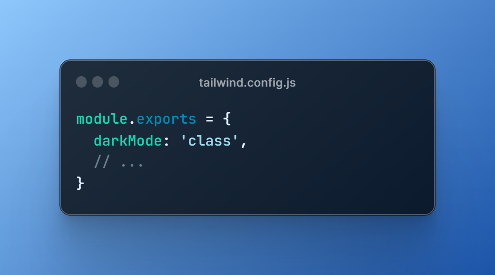

# 🌙 Dark Mode

The dark mode functionality in this theme allows users to switch between light and dark modes. The initial mode is set based on the user's system preferences. If the user manually changes the setting using the dark mode toggle, this setting will be stored in local storage and will persist across page reloads.

<figure><figcaption>
Dark Mode with Tailwind CSS
</figcaption></figure>
